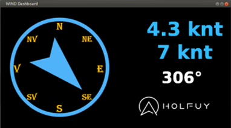
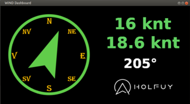
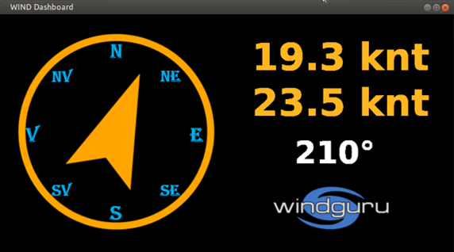
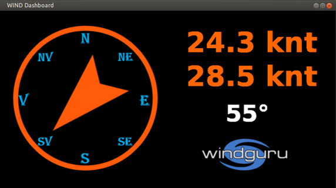
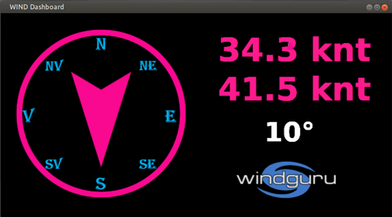

# Windguru and Holfuy display

A PyGame-based wind data display.

Display local Windguru or Holfuy data on Raspberry Pi.

||||
| ----------------------------------------- | ----------------------------------------- | ----------------------------------------- |
|||                                           |    
  
Installation instructions

# Install Python 3
$ sudo apt-get install python3

$ sudo apt-get install python3-pip

$ sudo apt-get install libsdl1.2-dev libsdl-ttf2.0-dev libsdl-image1.2-dev libsdl-mixer1.2-dev libjpeg-dev libportmidi-dev libtimedate-perl

# Install Pygame
$ pip3 install pygame

# Install requests
$ pip3 install requests

# Install windguru-holfuy 
$ git clone https://github.com/ciprian288/Windguru-and-Holfuy-display.git

  # Run windguru-holfuy
- edit config.py with data for wind service and location

$ cd Windguru-and-Holfuy-display

$ python3 wind.py

#    To EXIT wind.py -- press Q    ####

© 2021 GitHub, Inc.
